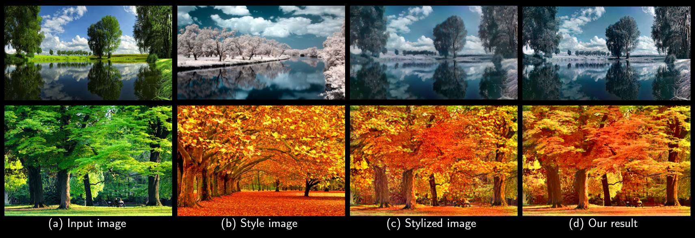

# Photorealistic Style Transfer with Screened Poisson Equation

[Roey Mechrez](http://cgm.technion.ac.il/people/Roey/) , [Eli Shechtman](https://research.adobe.com/person/eli-shechtman/) and [Lihi Zelnik-Manor](http://lihi.eew.technion.ac.il/). BMVC 2017.

[[The Project Page]](http://cgm.technion.ac.il/Computer-Graphics-Multimedia/Software/photorealism/)


SPE - MATLAB 1.0 (2017-02-21)
Copyright 2006-2017 Roey Mechrez Licensed for noncommercial research use only.

<div align='center'>
  
</div>

  

## Background

This code implements a fast Template Matching in the wild algorithm.

The algorithm solves the following problem: style transfer algorithms generate unrealistic images, this algorithm is a post-processing to any style transfer method (such as Gatys et al.). The algorithm solves the Screen Poisson equation to combine the stylized image with the original image gradients. 

For more information see:
```
@article{mechrez2017Photorealistic,
  title={Photorealistic Style Transfer with Screened Poisson Equation},
  author={Mechrez, Roey, Shechtman, Eli and Zelnik-Manor, Lihi},
  journal={BMVC},
  year={2017}
}
```

[[arXiv]](https://arxiv.org/abs/1709.09828)
Please cite these paper if you use this code in an academic publication.

			
### (optional) for deep features
 
 - MatConvNet: see [[MatConvNet code]](http://www.vlfeat.org/matconvnet/install/)
 - imagenet-vgg-verydeep-19.mat should be download from [[vgg]](http://www.vlfeat.org/matconvnet/models/imagenet-vgg-verydeep-19.mat and placed inside folder $\DDIS_code_matlab\utils\deepFeatures).
 - FLANN: we find it hard to recomplie the project, we provide mex files. This is optional
            if L2 between deep features is desirable. Otherwise just use cosine distance.


## Use

To run one pair of images use 
```
example.m
```
core functions:
 - doPoissonCombination.m and updateImagePoisson.m


## License

   This software is provided under the provisions of the Lesser GNU Public License (LGPL). 
   see: http://www.gnu.org/copyleft/lesser.html.

   This software can be used only for research purposes, you should cite
   the aforementioned papers in any resulting publication.

   The Software is provided "as is", without warranty of any kind.


## Code References

[1] Mechrez, Roey and Shechtman, Eli and Zelnik-Manor, Lihi. "Saliency Driven Image Manipulation". arXiv preprint arXiv:1612.02184. 2016 [url](https://arxiv.org/abs/1612.02184)

[2] Darabi, Soheil and Shechtman, Eli and Barnes, Connelly and Goldman, Dan B and Sen, Pradeep. "Image melding: Combining inconsistent images using patch-based synthesis." ACM Trans. Graph. 2012 [url](http://www.ece.ucsb.edu/~psen/melding)

[3] Fujun Luan, Sylvain Paris, Eli Shechtman, Kavita Bala. "Deep Photo Style Transfer". CVPR. 2017 [url](https://github.com/luanfujun/deep-photo-styletransfer)


## Version History

* Version 1.0 (2017-02-21)
   Initial Release
